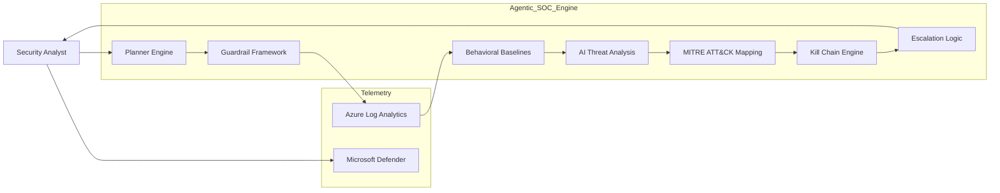
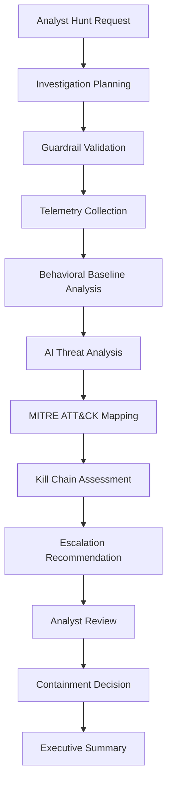
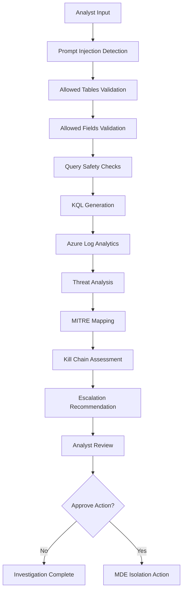

# 🧠 Agentic SOC Engine

### AI-Powered Threat Hunting & SOC Automation Platform

**Author:** Tracey Buentello  
**Platform Type:** AI-Assisted SOC Investigation Engine  
**Purpose:** Cognitive threat hunting, behavioral baselining, kill-chain analysis, escalation decision support, and analyst-guided response workflows.

---

# 🎥 Live Platform Demo

▶ Watch the Full Demo

https://www.linkedin.com/posts/activity-7416285113862373376-QAoQ

### Demonstrated Capabilities

- Analyst-intent driven threat hunting
- Behavioral baseline modeling
- Rare activity detection
- Automated investigation pivots
- Kill-chain mapping
- Escalation decision support
- Executive summary generation
- Analyst-approved containment actions

---

# 🖥️ Platform Screenshots

### 1. Analyst Hunt Intake & Safe Tool Selection

### 2. Baseline Modeling & Rare Behavior Detection

### 3. Kill-Chain Assessment & Automated Pivot Recommendations

### 4. Cognitive Threat Findings & Isolation Decision Workflow

### 5. Executive Summary & Machine Isolation Result

---

# 🎯 Overview

Agentic SOC Engine is an AI-assisted security operations platform designed to augment SOC analysts through automated investigation workflows, contextual enrichment, behavioral baselining, kill-chain analysis, and analyst-approved response actions.

The platform combines security telemetry, AI-assisted reasoning, and human-in-the-loop decision making to accelerate investigations while maintaining operational safety.

The objective is not to replace analysts.

The objective is to increase analyst efficiency, consistency, and investigative depth.

---

# 🏗️ Architecture

The platform follows a structured investigation workflow designed around safety, explainability, and analyst oversight.

## Core Components

| Component | Purpose |
|------------|------------|
| Planner Engine | Investigation planning and pivot generation |
| Guardrails | Query validation and AI safety controls |
| Baseline Engine | Behavioral anomaly detection |
| Threat Analysis Layer | AI-assisted evidence evaluation |
| Kill Chain Engine | Attack lifecycle mapping |
| Escalation Engine | Severity scoring and response guidance |
| Defender Integration | Analyst-approved containment actions |

---

# 🧩 Platform Stack

- Python 3.10+
- Azure Log Analytics (KQL)
- Microsoft Defender for Endpoint (MDE)
- OpenAI API
- REST API Integrations
- SQLite Baseline Storage
- Token-Safe Evidence Pipelines

---

# 🔍 Threat Hunting Workflow

The platform follows a structured investigation methodology designed to reduce analyst workload while maintaining investigative rigor.

## Investigation Flow

### 1. Analyst Hunt Submission

Examples:

- Suspicious PowerShell Activity
- Lateral Movement Investigation
- Credential Abuse Investigation
- Suspicious Network Activity

### 2. Investigation Planning

The Planner Engine identifies:

- Relevant telemetry sources
- Required fields
- Time windows
- Investigation pivots

### 3. Guardrail Validation

Before execution:

- Allowed tables verified
- Allowed fields verified
- Injection checks performed
- Query limits enforced

### 4. Telemetry Collection

Data is collected from supported Microsoft Defender and Azure Log Analytics sources.

### 5. Behavioral Baseline Analysis

Current activity is compared against historical behavior patterns.

### 6. AI-Assisted Threat Analysis

Evidence is evaluated for:

- Suspicious indicators
- Behavioral anomalies
- Threat patterns
- Investigation findings

### 7. Kill Chain Assessment

Observed behaviors are mapped to attack lifecycle stages.

### 8. Analyst Review

Findings and recommendations are presented to the analyst.

### 9. Optional Response Action

Containment actions require analyst approval.

---

# 🛡️ Guardrail Framework

Security and safety controls are implemented throughout the platform to prevent unsafe AI behavior.

## Query Validation

The platform restricts:

- Allowed telemetry tables
- Allowed fields
- Time ranges
- Result limits

## Prompt Injection Detection

Inputs are inspected for:

- Instruction override attempts
- Tool manipulation attempts
- Unauthorized query generation

## Model Governance

Only approved AI models may be used.

## Response Governance

The platform cannot:

- Execute arbitrary commands
- Generate unrestricted KQL
- Perform containment actions autonomously

## Human-in-the-Loop Design

All remediation actions require analyst approval.

---

# ⚔️ Kill Chain Analysis

The platform maps observed activity to attack lifecycle stages to support prioritization and escalation.

## Supported Stages

- Initial Access
- Execution
- Persistence
- Privilege Escalation
- Defense Evasion
- Credential Access
- Discovery
- Lateral Movement
- Collection
- Exfiltration
- Impact

## Escalation Levels

| Level | Description |
|---------|---------|
| Monitor | Continue observation |
| Elevated Hunt | Additional investigation required |
| Prepare Containment | Analyst review recommended |
| Containment Recommended | High-confidence threat identified |
| Isolation Candidate | Analyst approval required |

---

# 👨‍💻 Analyst Approval Model

The Agentic SOC Engine follows a Human-in-the-Loop security model.

## Principle

**AI assists. Analysts decide.**

## Autonomous Functions

- Investigation planning
- Data collection
- Threat analysis
- Baseline generation
- MITRE ATT&CK mapping
- Investigation recommendations

## Analyst-Approved Functions

- Device isolation
- Device release
- Host containment
- Security control changes
- Future remediation workflows

This model supports governance, auditability, and operational safety.

---

# 🎯 MITRE ATT&CK Mapping

The platform maps observed behaviors to MITRE ATT&CK techniques to improve investigation context and reporting.

## Example Techniques

| Technique | Description |
|------------|------------|
| T1059 | Command and Scripting Interpreter |
| T1021 | Remote Services |
| T1078 | Valid Accounts |
| T1105 | Ingress Tool Transfer |
| T1041 | Exfiltration Over C2 Channel |
| T1562 | Impair Defenses |

Mappings are generated from observed telemetry and investigation findings.

---

# 🔌 Integrated Data Sources

- DeviceLogonEvents
- DeviceProcessEvents
- DeviceNetworkEvents
- DeviceFileEvents
- IdentityLogonEvents
- Additional Microsoft Defender telemetry sources

---

# 🚀 Future Roadmap

## Phase 1 – Current Capabilities

- Cognitive Threat Hunting
- Behavioral Baselines
- Kill Chain Mapping
- Escalation Logic
- Analyst Approval Workflow
- Defender Integration

## Phase 2 – Planned Enhancements

- Multi-Agent Investigation Workflows
- Threat Intelligence Enrichment
- Expanded MITRE ATT&CK Coverage
- Enhanced Baseline Learning

## Phase 3 – Long-Term Vision

- Autonomous Remediation Workflows
- Security Orchestration
- Detection Engineering Recommendations
- AI Security Risk Scoring
- Threat Intelligence Correlation

## Phase 4 – HERSEC Integration

- Multi-Tenant Architecture
- Case Management
- Investigation Workspaces
- Customer Reporting
- Security Automation Platform
- AI-Powered SOC Operations

---

# 👤 Author

Built and maintained by **Tracey Buentello**.

**AI Security Engineer | Security Automation Engineer | Detection Engineering | Threat Hunting**

This project demonstrates AI-assisted threat hunting, security automation, detection engineering, AI governance principles, and SOC workflow orchestration.

---

# Intellectual Property Notice

This project is provided for portfolio, educational, and evaluation purposes only.

Commercial use, redistribution, modification, reproduction, or incorporation of substantial portions of this project into another product or service is prohibited without written permission from the author.

Copyright © 2026 Tracey Buentello. All Rights Reserved.
